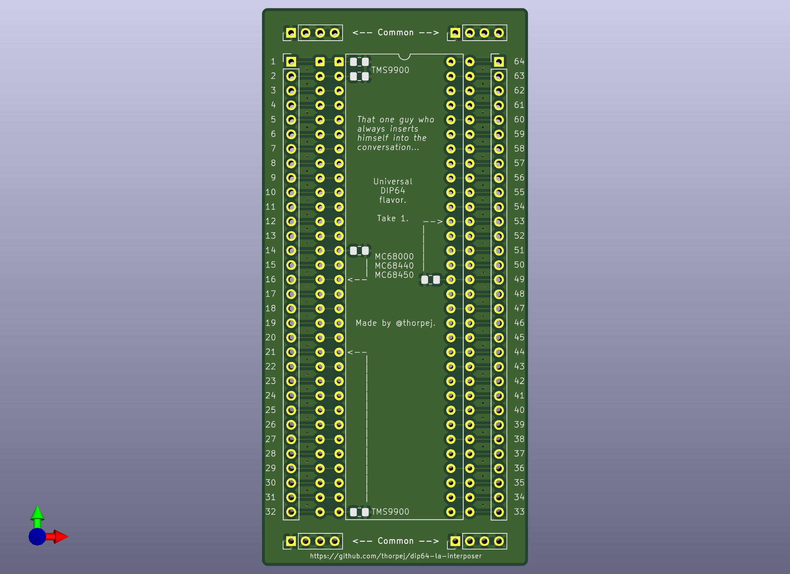

# A Universal DIP64 Logic Analyzer Interposer Board For Lazy People (like me)
I'm a silly person who likes to hack on old computers, so sometimes I
find myself in need of connecting a large number of logic analyzer
probe leads to a chip in a DIP64 package.  I find this a bit tedious
if my only option is mini-grabbers.  So I built a board to make it
easier!

This work is licensed under the [Creative Commons Attribution
ShareAlike 4.0 International license](https://creativecommons.org/licenses/by-sa/4.0/).

The idea is pretty simple: Downward-facing machined pin headers and
upward-facing machined SIP sockets come together to form an interposer
board that bring the signals out pin headers for the probe leads.  A
Dupont wire is used to jumper the chip's GND pin to any one of the
Common pins, which can then provide grounding sources for the probes.
Pointers to GND pins for MC68000 / MC68440 / MC68450 and TMS9900 are
provided for conveniences.  Footprints for 0805 SMT decoupling capacitors
are also provided should you find them necessary to counteract the
additional inductance added by the interposer.

If you have any questions about the board, you can reach out to me on
Twitter (*[@thorpej](https://twitter.com/thorpej)*) or Mastodon
(*[@thorpej@mastodon.sdf.org](https://mastodon.sdf.org/@thorpej)*).
